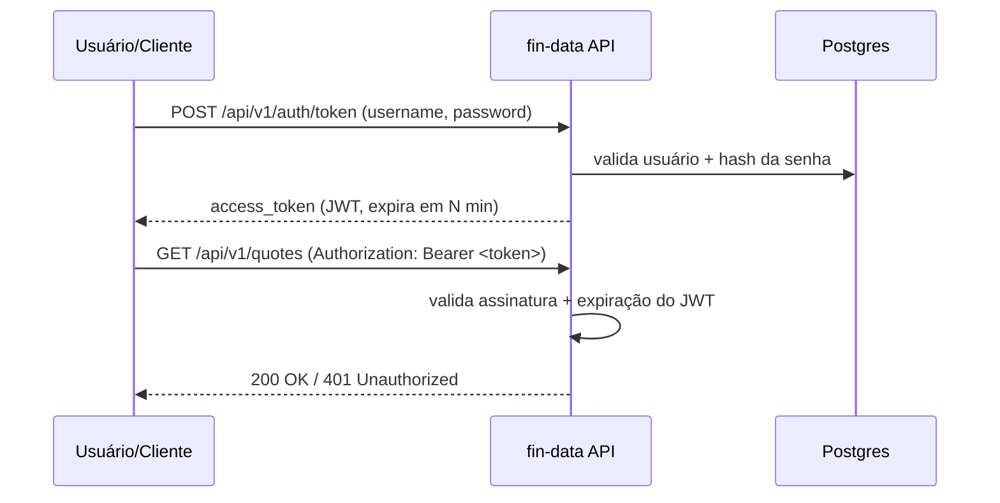

# Autenticação da API

Este documento descreve o mecanismo de autenticação da `fin-data` API: como os
clientes obtêm um token de acesso e como esse token é validado em cada
requisição.

## Visão geral

A API usa o fluxo **OAuth2 Password Flow** com tokens **JWT** transportados no
header `Authorization: Bearer <token>`. Não há sessões no servidor: o próprio
token, assinado com uma chave secreta, carrega a identidade do usuário e sua
validade expira após um tempo fixo.



## Componentes

| Componente | Local | Descrição |
| --- | --- | --- |
| Tabela `users` | [`src/infrastructure/database/models.py`](../src/infrastructure/database/models.py) | `id`, `username` (único), `hashed_password`, `is_active`, `created_at`. Sem roles/permissões — apenas "existe e está ativo". |
| Hash de senha | [`src/application/auth/service.py`](../src/application/auth/service.py) | `bcrypt` para gerar e verificar o hash da senha. |
| Emissão/validação de JWT | [`src/application/auth/service.py`](../src/application/auth/service.py) | `pyjwt`, algoritmo `HS256`. Claims: `sub` (username) e `exp`. |
| Endpoint de login | [`src/api/routers/auth.py`](../src/api/routers/auth.py) | `POST /api/v1/auth/token`, usando `OAuth2PasswordRequestForm` (form `username`/`password`). |
| Dependency de proteção | `get_current_user` em [`src/api/routers/auth.py`](../src/api/routers/auth.py) | Decodifica o Bearer token e carrega o usuário; aplicada nos routers protegidos. |
| Criação de usuário | [`scripts/create_user.py`](../scripts/create_user.py) | Script de linha de comando; não há endpoint público de cadastro. |

## Escopo de proteção

Todos os endpoints exigem um token válido, com exceção dos health checks:

- `GET /health`, `GET /health/live`, `GET /health/ready` — públicos.
- `POST /api/v1/auth/token` — público (é o próprio endpoint de login).
- Todos os demais endpoints (`/api/v1/quotes/...`, `/api/v1/ingestion/...`) — exigem
  `Authorization: Bearer <token>`.

A proteção é aplicada no nível do router, em
[`src/api/app.py`](../src/api/app.py):

```python
app.include_router(quotes.router, prefix="/api/v1", dependencies=[Depends(get_current_user)])
app.include_router(ingestion.router, prefix="/api/v1", dependencies=[Depends(get_current_user)])
```

## Como usar

1. Criar um usuário (uma vez, via script):

   ```bash
   PYTHONPATH=. python scripts/create_user.py <username> <password>
   ```

2. Obter um token:

   ```bash
   curl -X POST http://localhost:8000/api/v1/auth/token \
        -d "username=<username>&password=<password>"
   ```

   Resposta:

   ```json
   { "access_token": "<jwt>", "token_type": "bearer" }
   ```

3. Chamar endpoints protegidos com o token:

   ```bash
   curl http://localhost:8000/api/v1/quotes/BTCUSD/latest \
        -H "Authorization: Bearer <jwt>"
   ```

## Configuração

Variáveis lidas em [`src/config/settings.py`](../src/config/settings.py):

| Variável | Padrão | Descrição |
| --- | --- | --- |
| `secret_key` | valor de desenvolvimento inseguro | Chave usada para assinar/validar os JWTs. **Deve ser sobrescrita em produção** via variável de ambiente ou `.env`. |
| `access_token_expire_minutes` | `60` | Tempo de validade do token de acesso. |

## Decisões de design (o que ficou de fora de propósito)

Para manter o sistema simples, as seguintes funcionalidades não foram
implementadas nesta primeira versão:

- Roles/scopes — apenas "autenticado vs não autenticado".
- Refresh token / blacklist de token — o token expira e o cliente faz login
  novamente.
- Login social / provedores OAuth2 externos.
- Endpoint público de cadastro de usuário.
- Rate limiting (pode ser adicionado depois, separadamente).
